# 30 brainrots originaux pour ta map UEFN

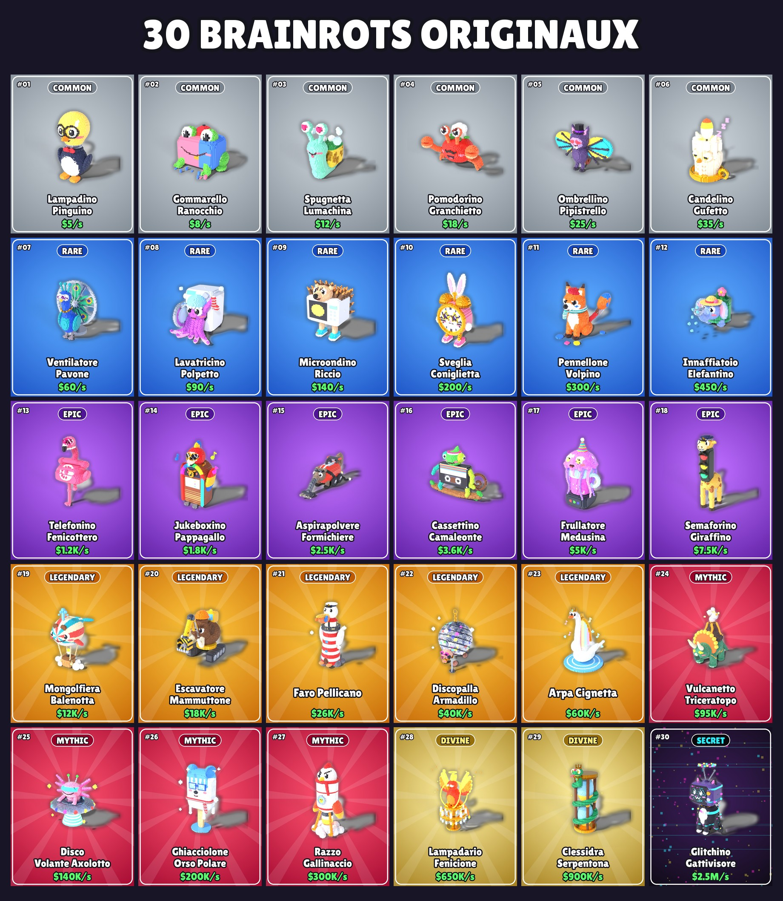

Trente personnages créés pour ta map, dans le style voxel des jeux « brainrot ». La formule est la même : **objet du quotidien + animal + nom pseudo-italien**. Chacun a son attitude : lunettes de soleil (cœur, étoile, aviateur, œil de chat), chaînes en or à médaillon, casquette à l'envers, haut-de-forme, toque de chef, casque de chantier, casquette de police ou de capitaine, visière cyber, yeux qui brillent, auréoles… Plus la rareté est haute, plus le modèle est grand et détaillé. Aucun ne reprend un personnage existant (Tung Tung, Tralalero, Strawberry Elephant…). Fais quand même une recherche rapide sur les noms avant de publier, l'univers brainrot est immense.

Chaque modèle est livré en :

| Fichier | Usage |
|---|---|
| `models/NN_nom/nom.fbx` | **À importer dans UEFN** (mesh statique, textures intégrées) |
| `models/NN_nom/nom.glb` | Aperçu rapide (Windows 3D Viewer, Blender, sites web) |
| `models/NN_nom/nom.vox` | Modifiable dans **MagicaVoxel** (gratuit) |
| `models/NN_nom/preview.png` | Rendu fond transparent (miniatures, UI, réseaux) |
| `previews/cards/NN_nom.jpg` | Carte « style jeu » (rareté, nom, revenu) |

Tous les modèles partagent **une seule palette** (`textures/`). Il suffit donc d'un seul matériau pour les 30, et une mutation se résume à changer de palette.

---

## Le roster

<!-- ROSTER_TABLE -->
| # | Aperçu | Nom | Rareté | Revenu | Concept | Taille (m) | Triangles |
|---|---|---|---|---|---|---|---|
| 01 | 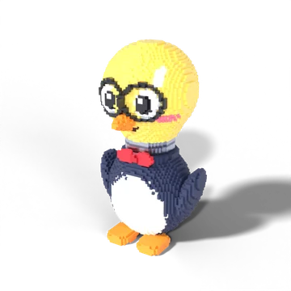 | **Lampadino Pinguino** | Commun | $5/s | Pingouin-génie dont la tête est une ampoule allumée ; lunettes rondes et nœud papillon. | 2.88 × 2.64 × 5.04 | 14 486 |
| 02 | 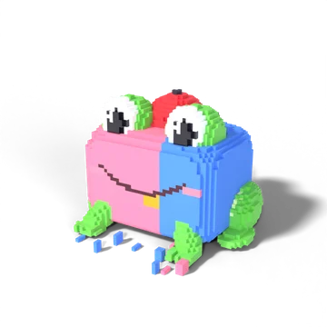 | **Gommarello Ranocchio** | Commun | $8/s | Grenouille-gomme bicolore, casquette à l'envers et dent en or. | 3.18 × 2.88 × 2.34 | 5 052 |
| 03 | 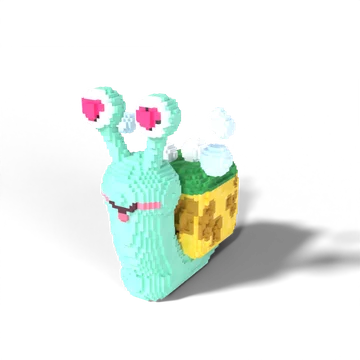 | **Spugnetta Lumachina** | Commun | $12/s | Escargot amoureux (yeux en cœur) dont la coquille est une éponge qui fait des bulles. | 2.88 × 3.66 × 3.84 | 11 518 |
| 04 | 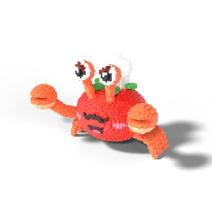 | **Pomodorino Granchietto** | Commun | $18/s | Crabe-tomate chef cuisinier : toque, moustache et sourcils froncés. | 4.32 × 2.82 × 3.18 | 12 374 |
| 05 | 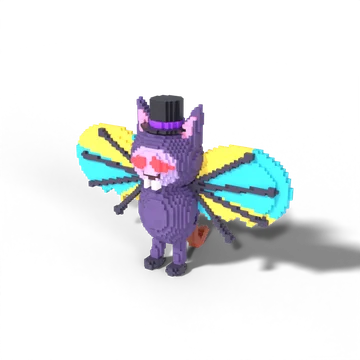 | **Ombrellino Pipistrello** | Commun | $25/s | Chauve-souris vampire en haut-de-forme, yeux rouges lumineux ; ses ailes sont un parapluie. | 5.34 × 2.4 × 3.78 | 9 104 |
| 06 | 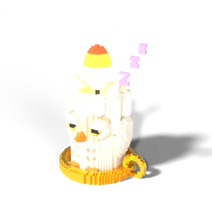 | **Candelino Gufetto** | Commun | $35/s | Bébé hibou en cire de bougie qui s'endort sur son bougeoir doré. | 3.0 × 2.46 × 4.14 | 6 802 |
| 07 | 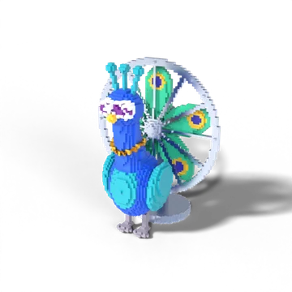 | **Ventilatore Pavone** | Rare | $60/s | Paon diva : roue-ventilateur, lunettes œil de chat et collier en or. | 3.78 × 3.48 × 4.68 | 12 856 |
| 08 | 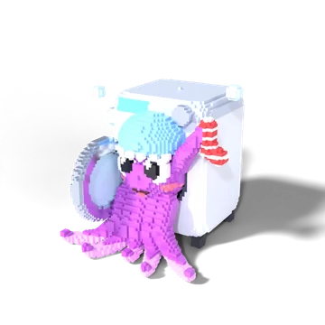 | **Lavatricino Polpetto** | Rare | $90/s | Pieuvre en bonnet de douche qui sort du hublot d'une machine à laver. | 3.66 × 3.96 × 3.78 | 10 638 |
| 09 | 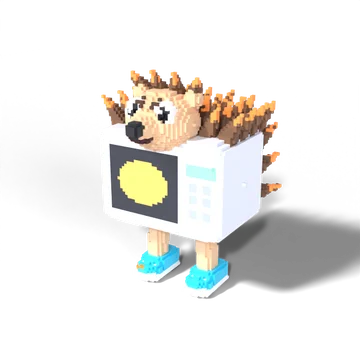 | **Microondino Riccio** | Rare | $140/s | Hérisson-micro-ondes debout en baskets, piquants brûlants comme des braises. | 3.3 × 3.36 × 4.68 | 13 990 |
| 10 | 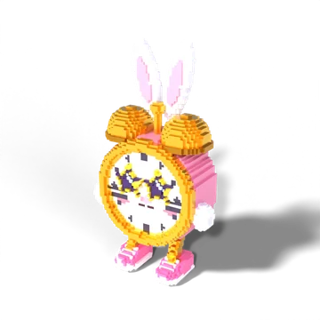 | **Sveglia Coniglietta** | Rare | $200/s | Lapine-réveil en baskets roses et lunettes étoiles. | 3.06 × 2.04 × 5.4 | 7 882 |
| 11 | 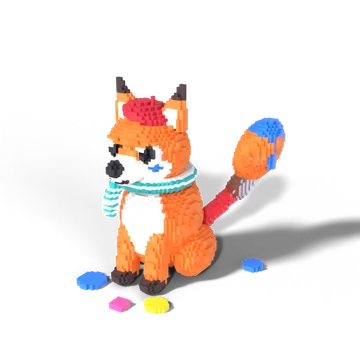 | **Pennellone Volpino** | Rare | $300/s | Renard artiste : béret, écharpe rayée et queue-pinceau trempée dans la peinture. | 3.12 × 4.14 × 4.26 | 14 546 |
| 12 | 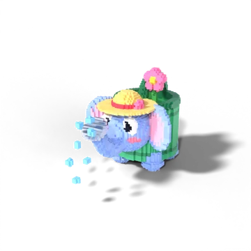 | **Innaffiatoio Elefantino** | Rare | $450/s | Bébé éléphant-arrosoir en chapeau de paille ; sa trompe est le bec verseur. | 2.94 × 5.16 × 3.18 | 10 788 |
| 13 | 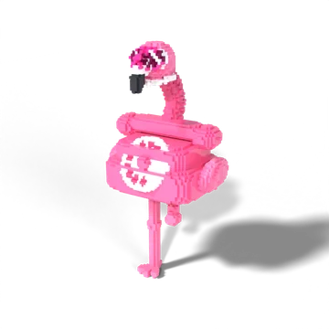 | **Telefonino Fenicottero** | Épique | $1.2K/s | Flamant rose diva : corps en téléphone à cadran, cou en fil spiralé, lunettes cœur et perles. | 3.06 × 2.58 × 6.12 | 8 356 |
| 14 | 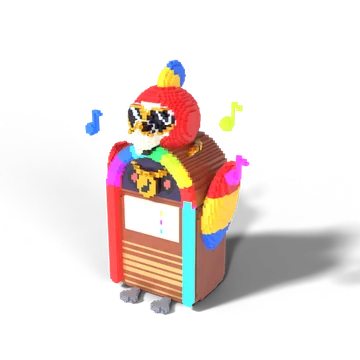 | **Jukeboxino Pappagallo** | Épique | $1.8K/s | Perroquet rockstar sorti d'un juke-box néon : aviateurs dorés et chaîne à note de musique. | 4.56 × 3.12 × 6.0 | 12 274 |
| 15 | 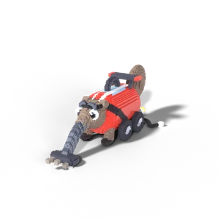 | **Aspirapolvere Formichiere** | Épique | $2.5K/s | Fourmilier-aspirateur tuné : lunettes de course, aileron et pots d'échappement enflammés. | 3.18 × 8.34 × 3.0 | 13 034 |
| 16 | 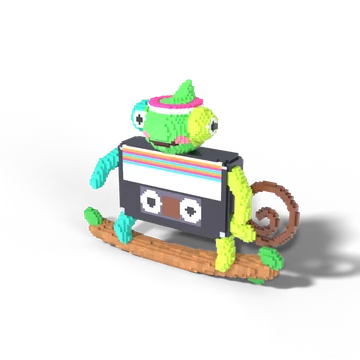 | **Cassettino Camaleonte** | Épique | $3.6K/s | Caméléon-cassette rétro avec bandeau années 80 ; sa queue est la bande magnétique. | 5.58 × 1.32 × 4.32 | 8 808 |
| 17 | 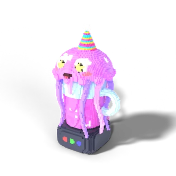 | **Frullatore Medusina** | Épique | $5K/s | Méduse fêtarde (chapeau pointu, yeux étoiles) posée sur un mixeur rempli de smoothie. | 3.24 × 2.88 × 5.7 | 14 246 |
| 18 | 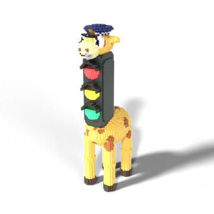 | **Semaforino Giraffino** | Épique | $7.5K/s | Girafe policière dont le cou est un feu tricolore ; casquette et sifflet. | 1.74 × 3.78 × 7.26 | 8 822 |
| 19 | 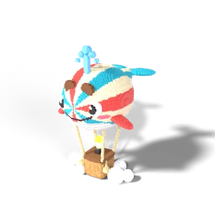 | **Mongolfiera Balenotta** | Légendaire | $12K/s | Baleine-montgolfière pilote : lunettes d'aviateur, nacelle en osier et nuages. | 4.68 × 6.3 × 7.62 | 29 336 |
| 20 | 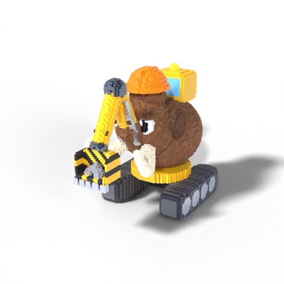 | **Escavatore Mammuttone** | Légendaire | $18K/s | Mammouth chef de chantier sur chenilles : casque orange, trompe en bras de pelleteuse. | 3.48 × 6.24 × 5.16 | 25 484 |
| 21 | 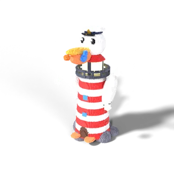 | **Faro Pellicano** | Légendaire | $26K/s | Pélican capitaine sur son phare rayé, lanterne allumée, poisson dans le bec. | 4.92 × 4.98 × 7.92 | 22 532 |
| 22 | 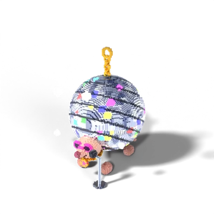 | **Discopalla Armadillo** | Légendaire | $40K/s | Tatou boule disco : lunettes de star, chaîne en or et micro sur pied. | 5.64 × 5.94 × 6.66 | 30 580 |
| 23 | 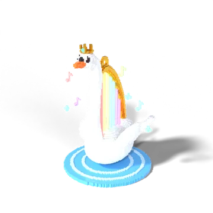 | **Arpa Cignetta** | Légendaire | $60K/s | Cygne couronné dont le cou forme une harpe dorée aux cordes arc-en-ciel lumineuses. | 4.74 × 4.98 × 6.78 | 19 392 |
| 24 | 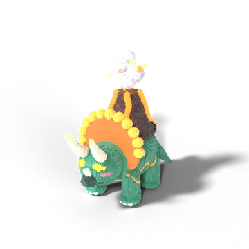 | **Vulcanetto Triceratopo** | Mythique | $95K/s | Tricératops volcanique : yeux de lave, piques d'obsidienne et éruption sur le dos. | 3.84 × 7.86 × 7.56 | 39 412 |
| 25 | 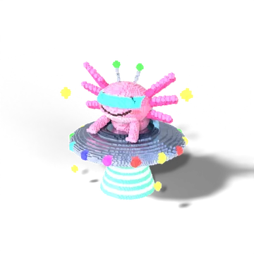 | **Disco Volante Axolotto** | Mythique | $140K/s | Axolotl extraterrestre à visière cyber et antennes, aux commandes d'une soucoupe volante. | 6.48 × 5.34 × 6.0 | 33 420 |
| 26 | 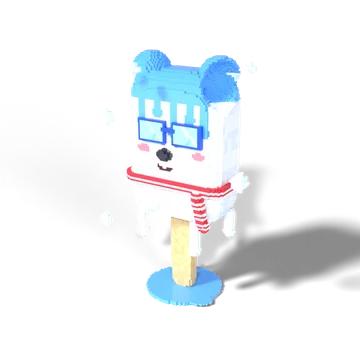 | **Ghiacciolone Orso Polare** | Mythique | $200K/s | Ours polaire esquimau, lunettes de glace et écharpe, croqué sur un coin. | 5.28 × 2.88 × 7.44 | 10 356 |
| 27 | 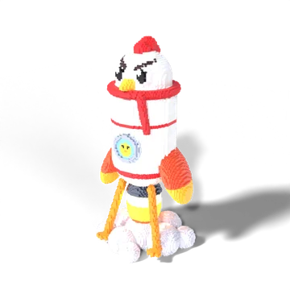 | **Razzo Gallinaccio** | Mythique | $300K/s | Poule-fusée au décollage : regard déterminé, écharpe de pilote, poussin au hublot. | 3.96 × 3.96 × 8.28 | 29 026 |
| 28 | 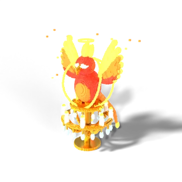 | **Lampadario Fenicione** | Divin | $650K/s | Phénix divin aux yeux de lumière, auréole et anneaux de feu, perché sur un lustre de cristal. | 7.26 × 5.04 × 9.06 | 43 118 |
| 29 | 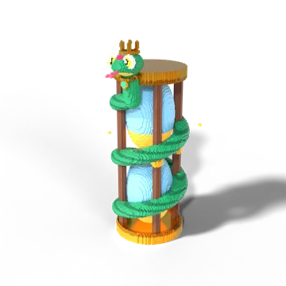 | **Clessidra Serpentona** | Divin | $900K/s | Serpent émeraude couronné enroulé autour d'un sablier de sable magique lumineux. | 4.92 × 5.52 × 10.32 | 50 022 |
| 30 | 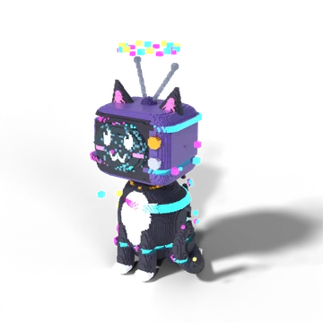 | **Glitchino Gattivisore** | Secret | $2.5M/s | Chat-télé glitché : écran pixel, chaîne en or, couronne de pixels et corps qui buggue. | 6.24 × 5.52 × 11.4 | 42 886 |
<!-- /ROSTER_TABLE -->

Les revenus sont des suggestions d'équilibrage (environ ×1,5 entre deux brainrots, avec un saut à chaque rareté). Adapte-les à ton économie.

---

## Importer dans UEFN (pas à pas)

### 1. Les textures (une seule fois)

1. Dans le Content Browser, crée un dossier `Brainrots/Textures`.
2. Glisse dedans `textures/T_Brainrot_BaseColor.png`, `T_Brainrot_ORM.png` et `T_Brainrot_Emissive.png`.
3. Ouvre chaque texture et règle :
   - **Filter** : `Nearest` (sinon les couleurs bavent entre les voxels)
   - **Mip Gen Settings** : `NoMipmaps`
   - Pour `T_Brainrot_ORM` uniquement : **Compression Settings** = `Masks` et **sRGB** décoché

### 2. Le matériau maître `M_Brainrot`

Crée un matériau `M_Brainrot` avec ce graphe :

```
TextureSampleParameter2D "Palette"   (T_Brainrot_BaseColor) ── RGB ──► Base Color
TextureSampleParameter2D "ORM"       (T_Brainrot_ORM)       ── G ────► Roughness
                                                             └─ B ────► Metallic
TextureSampleParameter2D "Emissive"  (T_Brainrot_Emissive)  ── RGB ─┐
ScalarParameter "EmissiveStrength" (défaut 4) ──────────────── × ───┴──► Emissive Color
```

Toutes les UV d'un même voxel pointent au centre d'un seul pixel de la palette. Il n'y a donc **aucun dépliage UV** à faire.

### 3. Les modèles

1. Crée `Brainrots/Meshes` et glisse les 30 fichiers `.fbx` (sélection multiple possible).
2. Dans la fenêtre d'import :
   - **Skeletal Mesh** : décoché (ce sont des meshes statiques)
   - **Generate Missing Collision** : coché
   - **Material Import Method** : `Do Not Create Material`. Ensuite, assigne `M_Brainrot` à chaque mesh. Tu peux aussi laisser UEFN créer les matériaux, mais tu en auras 30 copies identiques.
3. **Pivot** : au sol, au centre du personnage, ce qui le pose directement sur un piédestal.
4. **Échelle** : 1 voxel = 6 cm, et la résolution augmente avec la rareté (×1,4 pour les communs, ×2 pour le Secret). Les tailles vont d'environ 2,5 m (petits communs) à près de 11 m (Secret), comme dans les jeux où les rares sont les plus imposants. Tu peux les réduire dans UEFN avec l'échelle du prop.
5. **Orientation** : dans Blender, chaque brainrot regarde vers −Y. Si l'un d'eux est de dos ou de profil dans UEFN, fais-lui une rotation de 90° ou 180° en Z.

### 4. Les mutations

Dans `textures/mutations/` il y a 7 palettes prêtes : **Gold, Diamond, Void, Lava, Neon, Candy, BlackWhite**.

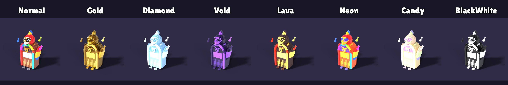

Pour chacune :

1. Clic droit sur `M_Brainrot` → *Create Material Instance* → `MI_Brainrot_Gold`.
2. Remplace les paramètres `Palette`, `ORM` et `Emissive` par les trois textures `_Gold`.
3. Applique l'instance sur le mesh. Si tu veux changer de mutation pendant la partie, prépare un prop par variante et fais apparaître la bonne.

Pour les mutations animées (arc-en-ciel *Party*, *Glitch*), voir la section 4 de `RECHERCHE_ASSETS_BRAINROT.md` à la racine du repo.

### 5. Donner vie aux brainrots

- **Flottement** : un petit va-et-vient vertical (prop mover ou `MoveTo` en Verse) et une rotation lente sur le piédestal suffisent à les rendre vivants.
- **Aura de rareté** : un système Niagara par rareté (étincelles dorées pour Divine, pixels magenta/cyan pour Secret).
- **Annonce** : bannière « Divine Brainrot Spawned ! » et flash post-process quand un Divine ou un Secret apparaît.

### Performances

Entre 5 000 et 45 000 triangles par modèle grâce au *greedy meshing* (fusion des faces de même couleur). La palette ne pèse que 32 × 32 pixels. Pour les plus gros (Mythic, Divine, Secret), active **Nanite** sur le mesh dans UEFN.

---

## Modifier ou en créer d'autres

Les modèles sont générés par du code, ce qui les rend faciles à retoucher :

```bash
pip install bpy numpy pillow        # bpy = Blender en module Python
cd brainrots/generator
python3 build.py                    # régénère les 30 (.vox, .glb, .fbx, rendus)
python3 build.py --only 7,12        # seulement certains modèles
python3 build.py --no-render        # sans rendus (rapide)
python3 cards.py --mutations 14     # cartes + planche + démo des mutations
```

- Chaque brainrot est une fonction dans `generator/roster.py`. Couleurs, tailles et accessoires se changent en quelques lignes.
- `generator/vox.py` est le moteur voxel : sphères, cylindres, tubes, peinture, décalques. Il travaille en « unités de design » et `build.py` multiplie la résolution selon la rareté (table `SCALE`).
- `generator/parts.py` contient le kit de style (lunettes, chapeaux, chaînes, baskets, yeux lumineux…) réutilisable pour en créer d'autres.
- Tu peux aussi ouvrir n'importe quel `.vox` dans MagicaVoxel pour le retoucher à la main.

La police des cartes, *Lilita One*, est sous licence SIL Open Font License (`generator/fonts/OFL.txt`). Elle ne sert qu'aux images d'aperçu.
